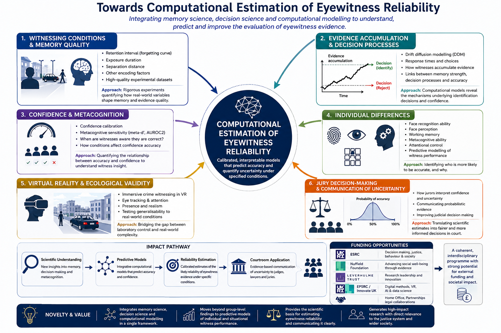

<h1>Computational Estimation of Eyewitness Reliability</h1>

A translational research programme integrating cognitive psychology, decision science, and computational modelling to develop scientifically grounded methods for estimating eyewitness reliability and translating those findings into evidence-based guidance, policy, and practice within the justice system.

### Grand Challenge

**How can the reliability of an eyewitness identification be estimated and communicated in ways that are scientifically rigorous, transparent, and useful for legal decision-making?**

Eyewitness evidence remains one of the most influential forms of evidence presented in criminal investigations and trials, yet its reliability is often evaluated using qualitative judgments. This programme aims to develop empirically grounded methods for estimating eyewitness reliability, understanding the cognitive processes that underpin identification decisions, and translating scientific findings into practical resources for investigators, courts, policy makers, and the public.

  

Long-term goal: To develop calibrated and transparent methods for estimating the probability that an eyewitness identification is correct in a specific case.

<h2>Research at a Glance</h2>

1

Published Article

2

Papers Under Review

2

Papers in Development

6

Programme Stages

<<h3>Research Programme Roadmap</h3>

The programme follows a translational pathway from witnessing conditions and decision indicators, through evidence accumulation, ecological validation, predictive reliability estimation, and legal translation.

Each stage is designed to generate both scientific knowledge and practical outputs, including training resources, professional guidance, predictive tools, and policy-relevant evidence, rather than deferring impact until the completion of the programme.

<a href="programme.html">Explore the full research programme →</a>

<a href="programme.html">View the full research programme →</a>

  <a class="homepage-button" href="programme.html">Research Programme</a>
  <a class="homepage-button" href="projects.html">Projects</a>
  <a class="homepage-button" href="publications.html">Publications</a>

