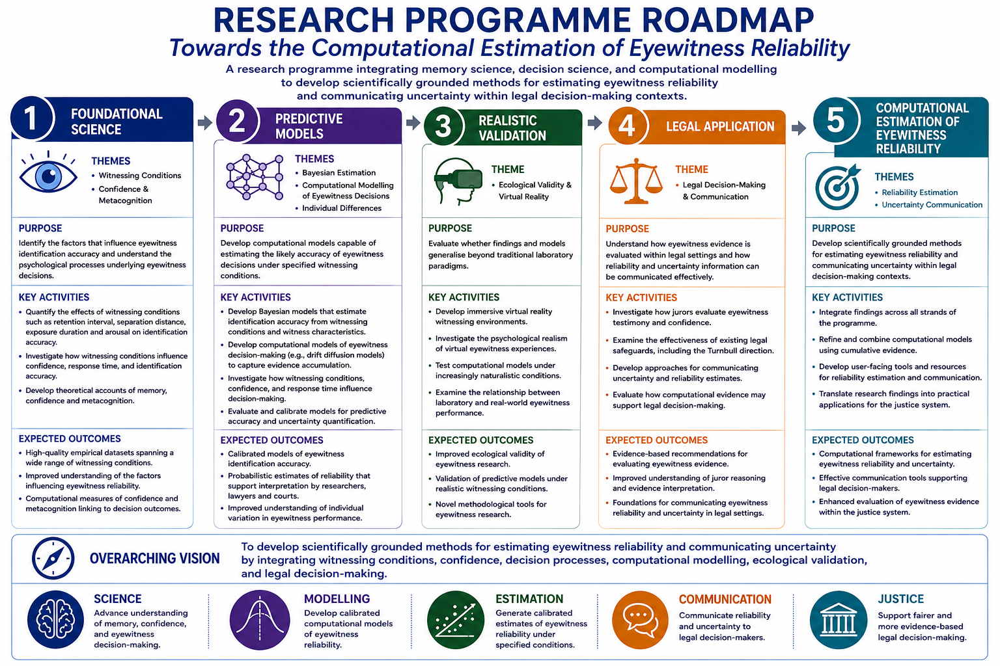

## The Challenge

Eyewitness evidence remains one of the most influential forms of evidence in criminal investigations and criminal trials. However, eyewitness accuracy varies substantially across individuals, witnessing conditions, and decision contexts.

While decades of research have identified factors associated with eyewitness error, courts and investigators are still largely required to evaluate eyewitness evidence qualitatively rather than quantitatively. The central challenge underpinning this programme is therefore:

> How can the reliability of an eyewitness identification be estimated and communicated in ways that are scientifically rigorous, transparent, and useful for legal decision-making?

Addressing this challenge requires understanding the conditions that influence eyewitness accuracy, modelling the decision processes that underpin identification decisions, and translating scientific findings into practical resources for investigators, courts, policy makers, and the wider public.

## Research Vision

The long-term aim of this programme is to develop calibrated, interpretable, and empirically grounded methods for estimating eyewitness reliability.

The programme integrates cognitive psychology, memory science, decision science, metacognition, computational modelling, and legal decision-making research. Together, these approaches seek to move beyond identifying factors associated with eyewitness performance towards estimating the probability that an eyewitness identification is correct under specified conditions.

Each stage of the programme is designed to generate both scientific knowledge and practical outputs, including professional guidance, training resources, predictive tools, and policy-relevant evidence, rather than deferring impact until completion of the overall programme.

## Research Programme Roadmap

::: {.figure-wrapper}
{alt="Research programme roadmap towards the computational estimation of eyewitness reliability"}
:::

# Core Translational Pathway

The programme follows a translational pathway from witnessing conditions and decision indicators, through evidence accumulation, ecological validation, predictive reliability estimation, and legal translation.

## Stage 1: Witnessing Conditions

### Aim

To quantify how witnessing conditions influence eyewitness accuracy.

### Research Areas

- Retention interval
- Separation distance
- Exposure duration
- Estimator variables affecting encoding, perception, and memory

### Current Work

- Forgetting curve modelling
- Viewing distance study
- Exposure duration study
- Estimator variable modelling

### Potential Impact

- Police training resources
- Expert witness evidence base
- Public-facing resources on eyewitness memory
- Evidence-based updates to professional understanding of witnessing conditions

---

## Stage 2: Decision Indicators

### Aim

To understand how observable decision characteristics predict eyewitness accuracy.

### Research Areas

- Confidence
- Response time
- Identification outcome
- Confidence–accuracy relationships

### Current Work

- Confidence calibration
- Confidence diagnosticity
- Confidence under varying witnessing conditions
- Modelling confidence, response time, and accuracy

### Potential Impact

- Guidance on interpretation of witness confidence
- Police interview guidance
- Judicial training materials
- Expert witness resources

---

## Stage 3: Evidence Accumulation and Decision Processes

### Aim

To understand the cognitive processes that underpin eyewitness identification decisions.

### Research Areas

- Evidence accumulation
- Evidence diagnosticity
- Computational decision modelling
- Drift diffusion modelling and related approaches

### Current Work

- Drift diffusion modelling of eyewitness decisions
- Evidence diagnosticity as a computational summary of decision quality
- Modelling how witnessing conditions influence decision processes
- Integrating confidence, response time, and accuracy

### Potential Impact

- Mechanistic explanations of eyewitness decision-making
- Improved predictive models
- Open-source modelling resources
- Computational research infrastructure

---

## Stage 4: Ecological Validation

### Aim

To determine whether laboratory-derived findings generalise to realistic eyewitness experiences.

### Research Areas

- Virtual reality eyewitness paradigms
- Naturalistic witnessing environments
- Presence and realism
- Behavioural and emotional responses in realistic settings

### Current Work

- Development of immersive eyewitness paradigms
- Planning of naturalistic virtual reality studies
- Presence and realism measurement

### Potential Impact

- Law-enforcement training environments
- Public engagement demonstrations
- Collaborative research platforms
- Interdisciplinary funding opportunities

---

## Stage 5: Predictive Reliability Estimation

### Aim

To integrate findings into calibrated models capable of estimating eyewitness reliability.

### Research Areas

- Bayesian reliability estimation
- Predictive modelling
- Model calibration
- Transparent uncertainty communication

### Current Work

- Bayesian modelling of eyewitness identification accuracy
- Calibration and predictive model evaluation
- Integration of witnessing conditions, confidence, response time, and identification outcomes

### Potential Impact

- Reliability tables
- Practitioner guidance
- Investigative decision-support resources
- Policy-relevant evidence for evaluating eyewitness identification evidence

---

## Stage 6: Translation to Justice

### Aim

To communicate eyewitness reliability information effectively within legal and investigative settings.

### Research Areas

- Jury decision making
- Probability communication
- Legal interpretation of eyewitness evidence
- Policy and practice translation

### Future Work

- Jury interpretation of eyewitness reliability estimates
- Communication of uncertainty
- Decision-support frameworks
- Evaluation of courtroom and investigative applications

### Potential Impact

- Jury education resources
- Judicial guidance
- Policy recommendations
- Contributions to evidence-based criminal justice reform

# Programme Extensions

Alongside the core translational pathway, several programme extensions strengthen understanding of eyewitness decision-making, improve prediction, and create opportunities for future scientific and societal impact.

## Confidence and Metacognition

This stream investigates when and why confidence predicts accuracy, how witnesses monitor their own memory, and how confidence diagnosticity changes across witnessing conditions.

Key areas include:

- Confidence calibration
- Metacognitive monitoring
- Confidence diagnosticity
- Confidence under varying retention intervals, separation distances, and exposure durations

## Individual Differences

This stream examines why some individuals may be more accurate eyewitnesses than others, and whether cognitive, perceptual, or metacognitive differences can improve reliability estimation.

Key areas include:

- Memory ability
- Face recognition ability
- Perceptual expertise
- Metacognitive individual differences

## Future Witnessing Variables

This stream extends the programme beyond the initial core variables of retention, distance, and exposure.

Potential areas include:

- Lighting
- Occlusion and disguise
- Attention
- Stress
- Cross-race identification

## Alternative Computational Approaches

This stream evaluates whether other computational frameworks can complement or improve upon current modelling approaches.

Potential approaches include:

- Leaky competitive accumulator models
- Signal detection approaches
- Bayesian observer models
- Alternative evidence accumulation models

# Long-Term Objective

The long-term objective of the programme is to develop scientifically grounded and transparent methods for estimating the probability that an eyewitness identification is correct under specified conditions, and to translate those methods into practical guidance, training, policy, and decision-support resources capable of improving the evaluation of eyewitness evidence within the justice system.
